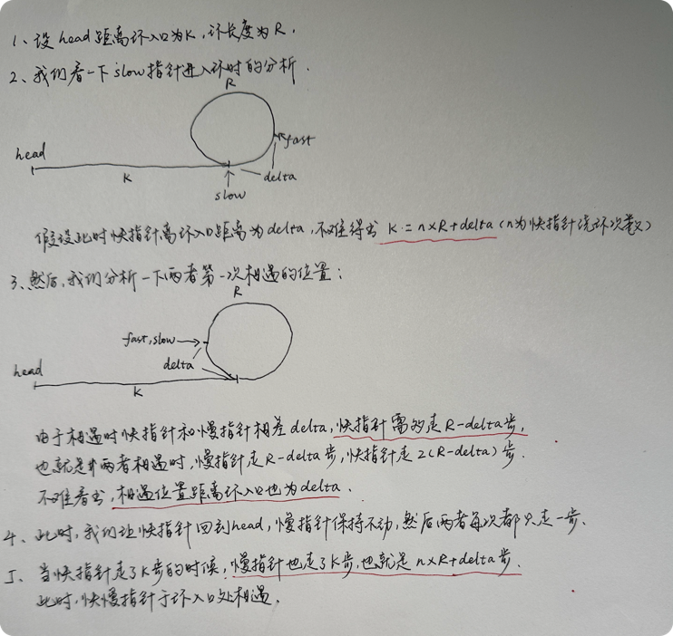

```azure
给定一个链表的头节点  head ，返回链表开始入环的第一个节点。 如果链表无环，则返回 null。
如果链表中有某个节点，可以通过连续跟踪 next 指针再次到达，则链表中存在环。 为了表示给定链表中的环，评测系统内部使用整数 pos 来表示链表尾连接到链表中的位置（索引从 0 开始）。如果 pos 是 -1，则在该链表中没有环。注意：pos 不作为参数进行传递，仅仅是为了标识链表的实际情况。
不允许修改 链表。
示例 1：
输入：head = [3,2,0,-4], pos = 1
输出：返回索引为 1 的链表节点
解释：链表中有一个环，其尾部连接到第二个节点。
示例 2：
输入：head = [1,2], pos = 0
输出：返回索引为 0 的链表节点
解释：链表中有一个环，其尾部连接到第一个节点。
示例 3：
输入：head = [1], pos = -1
输出：返回 null
解释：链表中没有环。
 
提示：

链表中节点的数目范围在范围 [0, 104] 内
-105 <= Node.val <= 105
pos 的值为 -1 或者链表中的一个有效索引
 

进阶：你是否可以使用 O(1) 空间解决此题？
```
## 双指针问题

我们定义两个指针
- 一个指针我们称之为快指针, 该指针每次跳两步
- 一个指针我们称之为慢指针, 该指针每次跳一步

我们让快慢指针同时从头节点出发
- 如果快慢指针相遇了, 我们让快指针重新指向head, 并且改为每次走一步, 他们相遇的节点就是要找的进入环的节点
- 如果快指针走到了结尾, 两者没有相遇, 那说明链表没有环

### 为什么两者相遇的节点就是环开始的节点呢?



## 如何求环的长度?
相遇时让快慢指针继续分别按2步/次, 1步/次的速度走, 第二次相遇时慢指针走的步数就是环的长度
